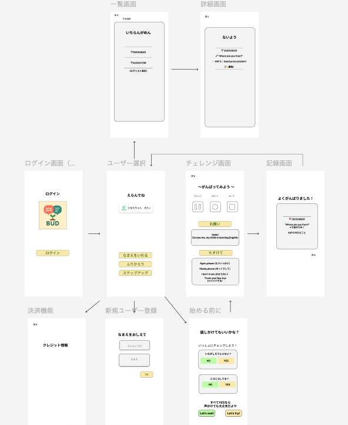

# プロジェクト README

## 📑 目次

- [1. プロジェクト概要](#1-プロジェクト概要)
- [2. 開発ガイドライン](#2-開発ガイドライン)
- [3. 環境セットアップ](#3-環境セットアップ)
- [4. ドキュメント一覧](#4-ドキュメント一覧)

---

## 1. プロジェクト概要

- [PRD（要件定義書）](./docs/prd.md)

---

## 2. 開発ガイドライン

- [非機能要件](./docs/non-functional-requirements.md)
- [運用計画](./docs/operations-plan.md)
- [セキュリティ](./docs/security.md)
- [ログ設計](./docs/logging.md)

---

## 3. 環境セットアップ

- [Firebase セットアップ手順](./docs/firebase/setup.md)

---

## 4. ドキュメント一覧

### PRD・要件定義

- [PRD](./docs/prd.md)

### 技術選定

- [PRD 内 技術選定セクション](./docs/prd.md)

### 画面設計

### v1（初期案）

### v2（最終版）

（完成後に追加予定）

### DB 設計

- [DB 設計](./docs/database-design.md)
- [ER 図（draw.io）](./docs/diagrams/database-er.drawio)

### API 設計

本アプリの API 仕様は **OpenAPI (Swagger)** で管理しています。

### 仕様ファイル

- [openapi/bud-api.yaml](openapi/bud-api.yaml)

---

### Swagger Editor で確認

1. [Swagger Editor](https://editor.swagger.io/) にアクセス
2. `File > Import File` から `openapi/bud-api.yaml` を読み込む

### テスト設計

- [テスト計画](./docs/test-plan.md)

### 非機能設計

- [非機能要件](./docs/non-functional-requirements.md)

### 運用設計

- [運用計画](./docs/operations-plan.md)

### 性能設計

- [性能計画](./docs/performance.md)

### ログ設計

- [ログ設計](./docs/logging.md)

### 可用性設計

- [可用性設計](./docs/availability.md)

### セキュリティ設計

- [セキュリティ](./docs/security.md)

### その他

- [音声機能仕様](./docs/voice-feature.md)
