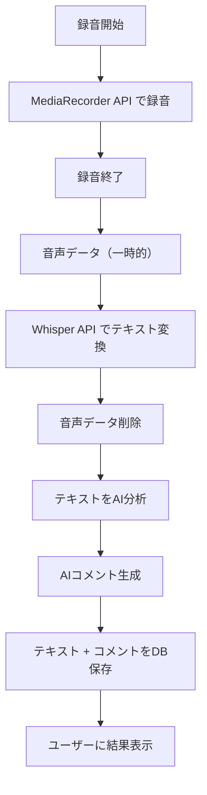

# BUD - 音声機能設計ガイド

BUD アプリケーションの音声機能（録音・音声認識・AI 分析・コメント生成）の設計方針とアーキテクチャを定義します。

## 🎯 音声機能の目的・要件

### 基本方針

- **子どものコミュニケーション支援**: 音声でのメッセージ作成と AI フィードバック
- **プライバシー優先**: 音声データは処理後に即座削除、テキストのみ保存
- **AI 分析によるサポート**: 文字起こし後に AI がコメント・励ましを生成
- **シンプルな UX**: 録音 → 文字起こし →AI 分析 → コメント表示の一連の流れ
- **データ最小化**: 必要最小限のテキストデータのみ永続化

### 機能フロー



### 技術要件

| 項目             | 要件                       | 目標値               |
| ---------------- | -------------------------- | -------------------- |
| **録音時間**     | 最大 30 秒間               | 開始まで 500ms 以内  |
| **音声処理**     | Whisper API でテキスト変換 | 2 秒以内完了         |
| **AI 分析**      | GPT-4 でコメント生成       | 3 秒以内完了         |
| **データ保存**   | テキストのみ DB 保存       | 音声データは即座削除 |
| **対応形式**     | MediaRecorder 対応形式     | WebM, MP4 推奨       |
| **プライバシー** | 音声データの永続化禁止     | 処理後即座削除       |

---

## 🏗️ アーキテクチャ設計

### 技術選定理由

#### MediaRecorder API

- **選定理由**: ブラウザ標準、追加ライブラリ不要
- **対応ブラウザ**: Chrome、Firefox、Safari（最新版）
- **出力形式**: WebM/MP4（ブラウザ依存）

#### Whisper API（OpenAI）

- **選定理由**: 高精度な日本語音声認識、子どもの声にも対応
- **代替案検討**: Web Speech API（精度の問題で不採用）
- **制限事項**: 25MB/ファイル、API 利用料金

#### GPT-4（AI 分析）

- **選定理由**: 子どもの年齢に応じたコメント生成が可能
- **プロンプト戦略**: 年齢別のシステムプロンプト適用
- **出力制限**: 100 文字程度の短いコメント

### システム構成図

```
[フロントエンド]
    ↓ 音声録音
[MediaRecorder API]
    ↓ 音声ファイル（一時）
[バックエンド API]
    ↓ 音声データ
[Whisper API] → テキスト変換
    ↓ テキスト
[GPT-4 API] → AIコメント生成
    ↓ 結果
[PostgreSQL] → テキスト保存（音声は削除済み）
```

---

## 💾 データベース設計

### 既存テーブル活用

```sql
-- challengesテーブルを音声機能で活用
challenges (
    id: UUID (PK)
    child_id: UUID (FK → children.id)
    challenge_type: 'voice_message'  -- 音声チャレンジを識別
    transcription: TEXT              -- 音声変換結果
    ai_comment: TEXT                 -- AIコメント
    processing_method: 'whisper_api' -- 処理方式
    confidence_score: DECIMAL(3,2)   -- 認識精度
    processing_time_ms: INTEGER      -- 処理時間
    audio_duration_seconds: DECIMAL  -- 音声の長さ
    created_at: TIMESTAMP
)
```

### データ関連図

```
users (親)
  ↓ 1:N
children (子ども)
  ↓ 1:N
challenges (音声チャレンジ)
```

---

## 🔒 プライバシー・セキュリティ設計

### 音声データ保護戦略

#### データフロー制御

1. **録音**: ブラウザメモリ内のみ
2. **アップロード**: 一時的なサーバーファイル
3. **処理**: Whisper API 呼び出し後、即座削除
4. **保存**: テキストのみ DB 保存

#### セキュリティ対策

- **一時ファイル**: 処理完了後の確実な削除
- **メモリ管理**: 音声データのメモリからの除去
- **アクセス制御**: 親子関係の認証確認
- **監査ログ**: 音声処理の実行履歴記録

### プライバシー保護実装方針

- ✅ 音声ファイルの永続化禁止
- ✅ 処理後の一時ファイル完全削除
- ✅ エラー時も含めた確実な削除保証
- ✅ 音声処理ログの個人情報除外

---

## 📱 ユーザーインターフェース設計

### 基本画面構成

#### 1. 録音画面

- **録音ボタン**: 大きく、子どもが押しやすい
- **進行表示**: 録音時間と進捗バー
- **視覚フィードバック**: 音声レベル表示（波形等）
- **制限表示**: 最大 30 秒の残り時間

#### 2. 処理中画面

- **ステップ表示**: 「音声を文字にしています...」「AI が分析中...」
- **処理時間**: リアルタイムでの経過時間表示
- **キャンセル**: 処理中断機能

#### 3. 結果表示画面

- **文字起こし結果**: 話した内容の表示
- **AI コメント**: 子どもへの励ましメッセージ
- **保存/再試行**: アクションボタン

### UX 考慮事項

- **年齢対応**: 3-12 歳の操作性を考慮
- **エラーハンドリング**: 子どもにも分かりやすいエラーメッセージ
- **レスポンシブ**: タブレット・スマートフォン対応

---

## 🔧 API 設計

### エンドポイント仕様

#### POST /api/voice/process-challenge

**目的**: 音声チャレンジの完全処理（録音 → 変換 →AI 分析 → 保存）

**リクエスト**:

- `audio`: 音声ファイル（multipart/form-data）
- `child_id`: 子ども ID（UUID）

**レスポンス**:

```json
{
  "success": true,
  "data": {
    "challenge_id": "uuid",
    "child_name": "太郎くん",
    "transcription": "今日は楽しかった",
    "ai_comment": "楽しい気持ちが伝わってきました！",
    "confidence": 0.95,
    "processing_time": 1500
  }
}
```

#### GET /api/voice/challenges/{child_id}

**目的**: 子どもの音声チャレンジ履歴取得

**パラメータ**:

- `child_id`: 子ども ID（UUID）
- `limit`: 取得件数（デフォルト: 20）

---

## 📊 監視・分析設計

### 成功率指標

- 音声認識成功率: 目標 95%以上
- AI 分析完了率: 目標 99%以上
- エンドツーエンド成功率: 目標 94%以上

### パフォーマンス指標

- 音声変換時間: 目標 2 秒以内
- AI 分析時間: 目標 3 秒以内
- 全体処理時間: 目標 5 秒以内

### ログ記録項目

- 処理時間（ステップ別）
- 認識精度スコア
- エラー発生パターン
- 利用頻度（時間帯・曜日別）

---

## 🚀 実装フェーズ

### Phase 1: 基本機能（MVP）

- [ ] MediaRecorder API 実装
- [ ] Whisper API 連携
- [ ] 基本的な UI 実装
- [ ] プライバシー保護機能

### Phase 2: AI 分析強化

- [ ] GPT-4 連携
- [ ] 年齢別プロンプト実装
- [ ] コメント品質向上

### Phase 3: UX 改善

- [ ] 視覚フィードバック強化
- [ ] エラーハンドリング改善
- [ ] パフォーマンス最適化

### Phase 4: 運用改善

- [ ] 詳細分析機能
- [ ] A/B テスト基盤
- [ ] 品質監視ダッシュボード

---

## ⚠️ リスク・制約事項

### 技術的制約

- **ブラウザ依存**: MediaRecorder API のサポート状況
- **API 制限**: Whisper API、GPT-4 のレート制限
- **ネットワーク**: 音声ファイルアップロードの通信品質依存

### ビジネス制約

- **API 費用**: OpenAI API の利用料金
- **ストレージ**: テキストデータの蓄積コスト
- **プライバシー規制**: 各国の音声データ取り扱い法規制

### 対応策

- **フォールバック**: Web Speech API への緊急切り替え
- **コスト制御**: API 利用量監視とアラート
- **コンプライアンス**: 法務確認とプライバシーポリシー更新

---

## 📝 まとめ

BUD の音声機能は**子どものコミュニケーション支援**と**プライバシー保護**を両立させる設計となっています。

**重要な設計原則**:

1. **プライバシーファースト**: 音声データの非保存
2. **子ども中心 UX**: 年齢に応じた操作性・フィードバック
3. **技術的信頼性**: 高精度な音声認識と AI 分析
4. **運用監視**: 品質とパフォーマンスの継続的改善

実装時は本設計書を基に、詳細なコード設計と技術選定を行ってください。
